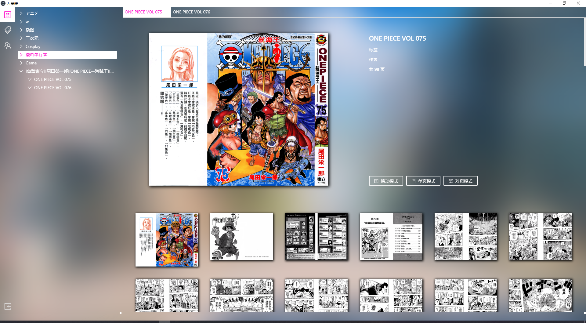
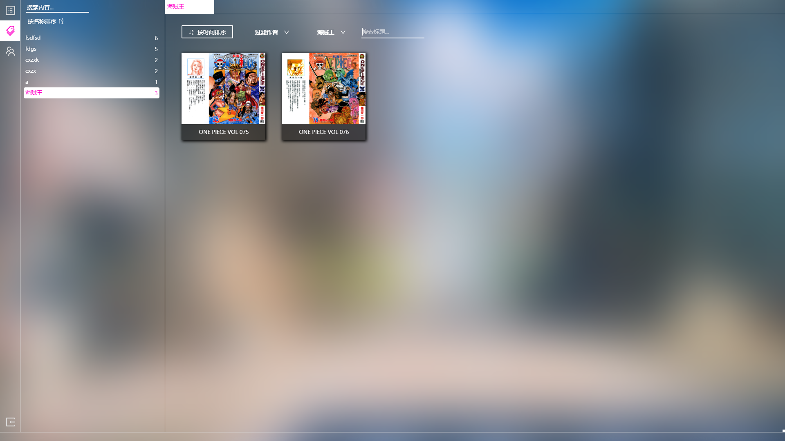
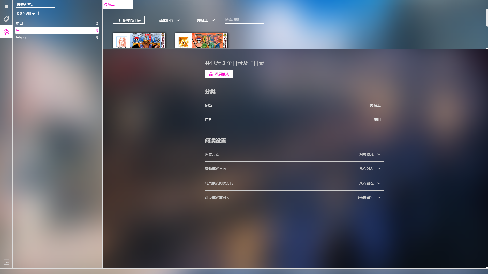

> ## 支持通道

 

> ## 题外

如果有愿意跟我共同维护、迭代的朋友，欢迎联系我，我可以大致讲解一下代码结构和思路，然后一起优化它！

 

至于要求：
1. 有Web前端经历即可，最好写过electron
2. 🙌没有人👐比我👌更懂☝用户体验

 

> ### 5.12 更新 版本 v1.4.2

压缩包 & 安装包分流：

百度网盘：https://pan.baidu.com/s/1iYSQehbjTonvL6qAnlLglg
提取码：lj68

[安装包v1.4.0](https://github.com/ArisAgeha/album-bankakyou/releases/download/v1.4.2/album-bankakyou-1.4.2.Setup.exe)

 

【新功能】

单页 / 对页模式下，可以使用【*】键锁定图片的缩放比例，使用【/】键锁定图片的位置，锁定后在换页时不会复原了
单页/对页模式下，翻页时，添加了首页/末页的提示
【BUG修复】

对页模式在图片较小时，现在左图会靠右、并且垂直居中，右图会靠左并且垂直居中了，不会出现两张图片中间留出空白的情况
一些小的UI修复

 

注意网盘内.exe文件是安装包并不是软件本体
会默认安装到 C:\Users\(你的用户名)\AppData\Local\gallery-bankakyou
并且在桌面新增一个快捷方式，请用快捷方式打开
请不要每次打开软件都执行这个.exe文件
（之前有人反映说打开慢…原来是把这个exe当作了软件本体…其实他只是自动安装完之后帮你打开软件而已。。        ）

 
 

> ## 简介

一款用于`windows`下的看图软件，支持`图墙`、`滚动阅读`、`对页阅读`、`单页阅读`等多种阅读模式。

(暂`不支持` Mac、Linux，后续版本观望是否加入 <del>其实是因为我没 MAC 来开发</del>)

各种阅读模式下都有便捷的自定义操作，如`调整阅读方向`（如国漫习惯从左往右阅读、日漫习惯从右往左阅读、韩漫习惯从上往下阅读等）、缩放等功能

`可以批量添加 / 管理文件夹的标签、作者信息`。标签、作者设置后可以据此筛选相册。

软件的各种设置基本都采用`鼠标手势`、`快捷键`来进行，没有复杂的菜单，UI十分精简。

现版本为 `Beta` 版，功能较为简单，但基本的阅读功能已经完善。

在近期的版本中，将会添加`收藏/播放列表功能`（类似于音乐软件的播放列表功能，只是将“歌”换为“相册”或“单张图片”）

(图片中出现的漫画来源为台湾网络，仅用作软件预览，如有冒犯，请联系删除)

 
 
 
 
 

 

> ## 使用手册

- ### 导入目录

1. 左下角导入按钮，导入相册文件夹

> ### 阅读

1. 单击目录树，选择一个相册目录即可进行阅读

2. 拖动目录树中的某个文件夹到右侧显示区域，可以将`该文件夹`与`该文件夹内的所有子文件夹`中的所有图片加入到阅读区域

3. 按住`ctrl` / `shift`键可以多选目录，可以将所有选择的目录同时拖动到阅读区域内，效果如2

 

> ### 各种阅读模式

| 阅读模式 | 说明                                                                                                                                                                        |
|----------|-----------------------------------------------------------------------------------------------------------------------------------------------------------------------------|
| 滚动阅读 | 图片首尾相连，采用滚动屏幕的方式阅读。可以调整滚动的方向（从上往下，从下往上，从左往右，从右往左）                                                                          |
| 对页阅读 | 自动拼接前后两张图片（只拼接两张高 > 宽的图片）并展示，一般用于观看漫画。`注意该模式需要拼接时间，如果图片数量非常大可能会造成软件短期卡顿`，一般来说图片数量小于2000张最好 |
| 单页阅读 | 常规的阅读模式                                                                                                                                                              |

 

> ### 设置某个或多个目录的作者/标签信息、及其阅读习惯

1. 从目录树中选择若干个目录

2. 同时按住鼠标左键 + 右键往上拖动即可打开设置

注意每次更换想要设置的目录后，都需要进行操作2来读取配置

 

> ### `快捷键`

全局的快捷键可以`参照浏览器`或`用户直觉`

例如 `ctrl + w` 关闭选项卡、`ctrl + tab`切换选项卡

`ctrl + 滚轮滚动` 可以在各种阅览区域进行缩放（为了节省用手，`右键 + 滚轮滚动`也能实现该功能）

>> #### 全局

| 全局快捷键                       | 说明                   |
|----------------------------------|------------------------|
| `F11`                            | 切换全屏               |
| `按住`鼠标`左右键`并且`往上拖动` | 对选中的文件夹进行配置 |
| `按住`鼠标`左右键`并且`往下拖动` | 快速隐藏配置窗口       |

>> #### 任意阅读模式

| 任意模式快捷键                  | 说明                                            |
|---------------------------------|-------------------------------------------------|
| `鼠标中键`                      | 进入全屏并且隐藏所有UI / 退出全屏并且还原所有UI |
| `ctrl`或`鼠标右键` + `滚轮滚动` | 缩放图片                                        |

>> #### 滚动阅读
| 滚动阅读快捷键 | 说明         |
|----------------|--------------|
| `6`            | 从左往右阅读 |
| `4`            | 从右往左阅读 |
| `2`            | 从上往下阅读 |
| `8`            | 从下往上阅读 |

>> #### 对页阅读
| 对页阅读快捷键 | 说明                                                                                               |
|----------------|----------------------------------------------------------------------------------------------------|
| `5`            | 更改阅读方向：从左往右 - 从右往左                                                                  |
| `0`            | 修正对页对齐，用户前后两页没有正确拼接的情况（如原本2、3页拼接到一起，修正后将变为3、4页拼接到一起 |
| `方向键`       | 换页                                                                                               |

>> #### 单页阅读
| 单页阅读快捷键            | 说明          |
|---------------------------|---------------|
| `任意数字键组合` + `回车` | 跳转到第 n 页 |
| `方向键`                  | 换页          |

> ### 更新方向

- 短期

1. 添加`收藏/播放列表功能`
2. 为各种载入状态添加更加圆滑的过渡效果或者“载入中”的提示，以优化在大量图片阅读下的用户体验（如现在对页模式处理图片量大于3000时(*hhd)会有明显的5~10多秒的卡顿，但无任何提示）
3. 自动阅读（例如单页模式、对页模式下的可自定义播放间隔的幻灯片播放，滚动模式下自动滚动）

- 近期

1. 加入`图片/相册管理操作`，如对文件夹的移动、复制、删除、重命名等
2. 优化目录树性能，替换为虚拟滚动
3. 软件内添加快捷键 / 操作提示
4. 相册/图片评分系统，可以自定义评分或根据用户浏览时长来自动打分

- 后续

1. 尝试将图片预览模式下的图片换为缩略图
2. 更多内容`可配置化`，如所有快捷键的更改、默认窗口的大小比例、开机是否自启动等

> ## 历史版本更新日志

> ### 5.10 更新 版本 v1.2.0

【新功能/特性】

- 大幅度优化同时加载大量图片到【预览区 / 滚动模式】时的性能，现在可以无压力地丢任意数量图片到预览区了
- 现在滚动模式也会显示部分视频格式的文件了
- 现在退出滚动模式时，会自动取消正在加载的图片
- 添加了进入对页模式的提示
 
【BUG修复】

- 修复滚动模式无法翻转阅读的BUG（从下到上、从右到左失效）
- 修复滚动模式下部分情况下出现图片偏位的BUG

 
 

> ### 5.9 更新 版本 v1.1.0

1. 添加了各种场景下的气泡提示
2. 任意阅读模式下，现在缩放行为是以鼠标为中心缩放了
3. 滚动阅读模式下，修复了一个懒加载失效导致同时加载所有图片，以致卡顿的BUG
4. 其他小BUG修复

 
